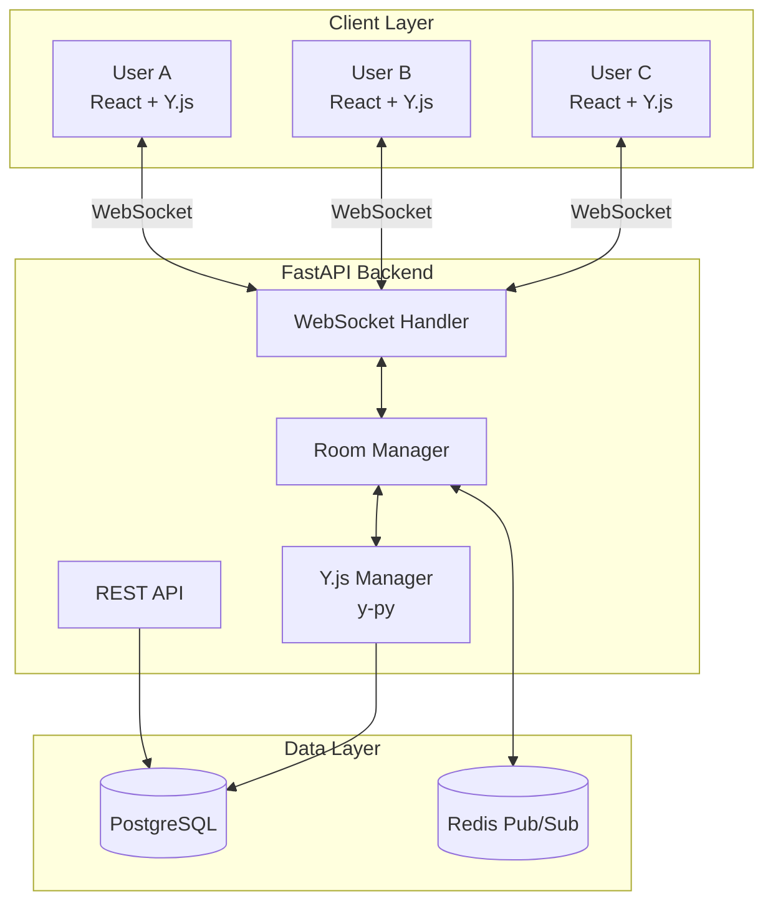
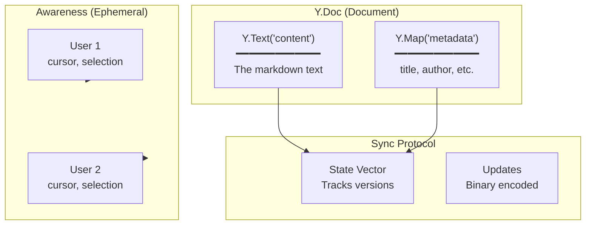
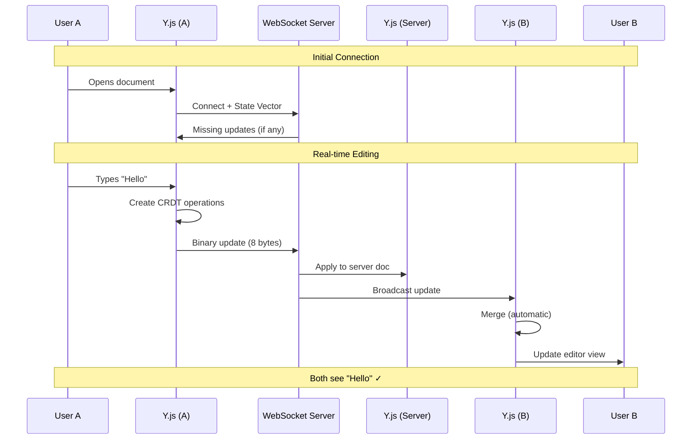
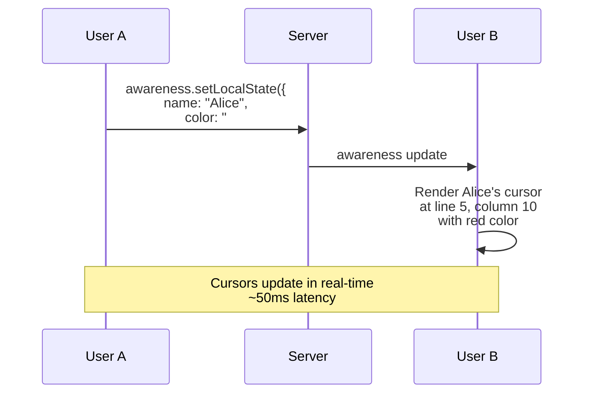
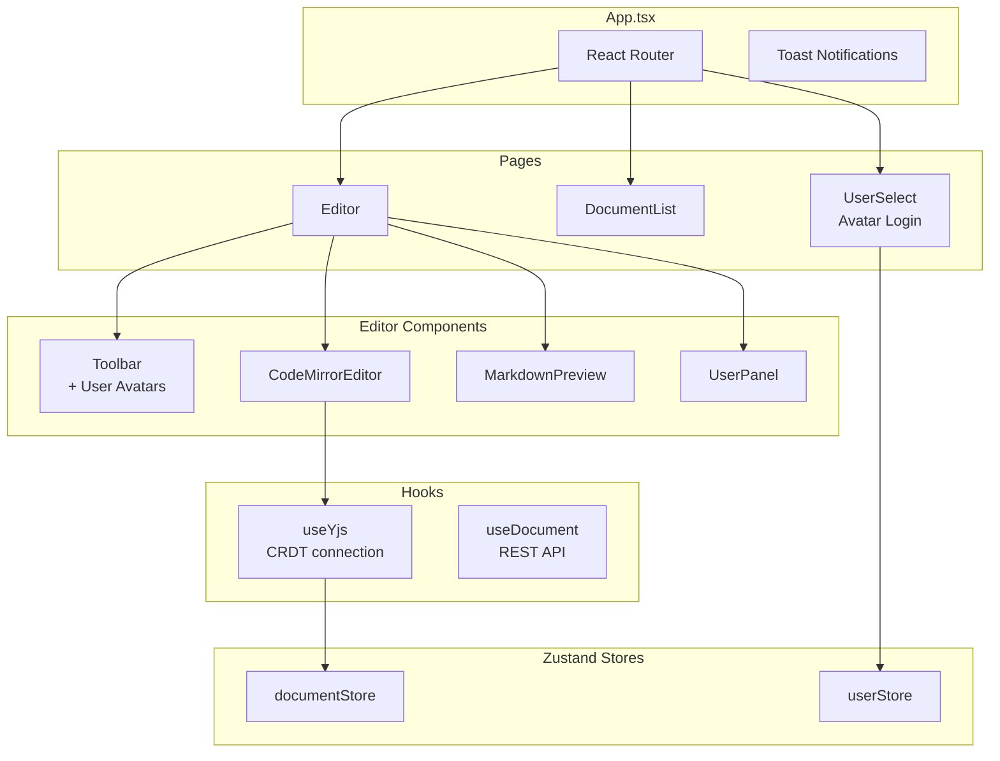
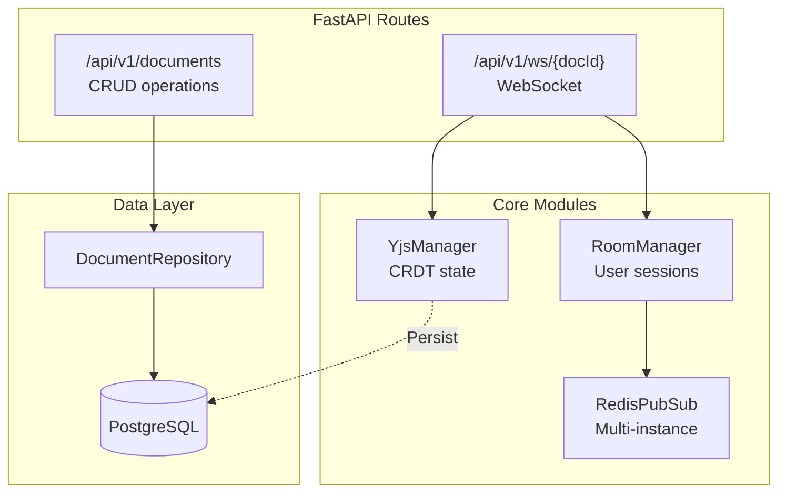
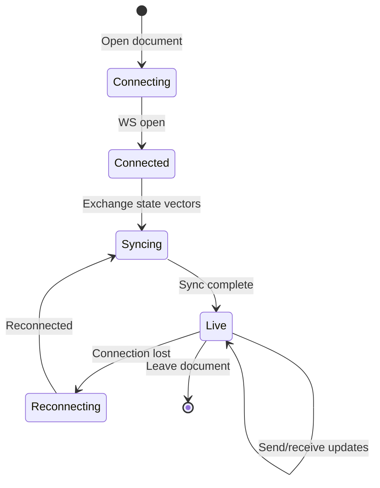
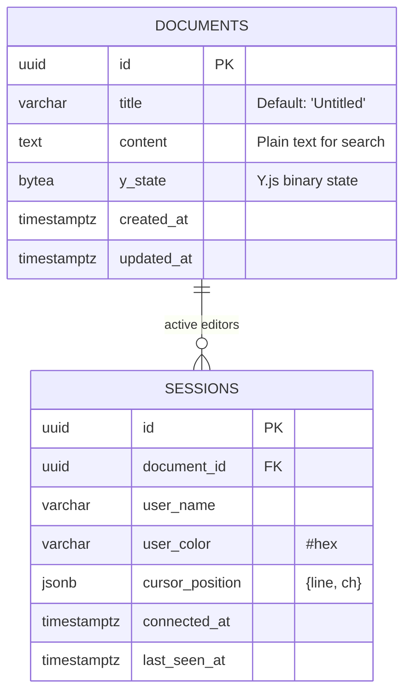
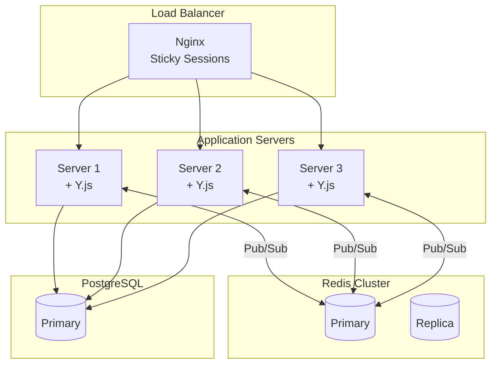

# LiveDoc Architecture & Technical Deep Dive

A comprehensive guide to understanding the LiveDoc collaborative markdown editor - perfect for technical interviews and professional showcases.

---

## Table of Contents
1. [High-Level Architecture](#high-level-architecture)
2. [What is CRDT?](#what-is-crdt)
3. [Y.js Deep Dive](#yjs-deep-dive)
4. [Real-Time Sync Flow](#real-time-sync-flow)
5. [Component Architecture](#component-architecture)
6. [WebSocket Protocol](#websocket-protocol)
7. [Data Persistence](#data-persistence)
8. [Scaling Architecture](#scaling-architecture)
9. [Key Interview Talking Points](#key-interview-talking-points)

---

## High-Level Architecture

```
┌─────────────────────────────────────────────────────────────────────────────┐
│                              LIVEDOC ARCHITECTURE                           │
└─────────────────────────────────────────────────────────────────────────────┘

    ┌──────────────┐         ┌──────────────┐         ┌──────────────┐
    │   User A     │         │   User B     │         │   User C     │
    │   Browser    │         │   Browser    │         │   Browser    │
    └──────┬───────┘         └──────┬───────┘         └──────┬───────┘
           │                        │                        │
           │  React + CodeMirror    │                        │
           │  + Y.js (CRDT)         │                        │
           │                        │                        │
           ▼                        ▼                        ▼
    ┌─────────────────────────────────────────────────────────────────┐
    │                     WebSocket Connections                        │
    │                  (Binary Y.js sync protocol)                     │
    └─────────────────────────────┬───────────────────────────────────┘
                                  │
                                  ▼
    ┌─────────────────────────────────────────────────────────────────┐
    │                      FastAPI Backend                             │
    │  ┌─────────────┐  ┌─────────────┐  ┌─────────────────────────┐  │
    │  │   REST API  │  │  WebSocket  │  │     Y.js Document       │  │
    │  │  /documents │  │   Handler   │  │       Manager           │  │
    │  └─────────────┘  └──────┬──────┘  └───────────┬─────────────┘  │
    │                          │                     │                 │
    │                          ▼                     ▼                 │
    │                   ┌─────────────┐       ┌─────────────┐         │
    │                   │    Room     │◄─────►│   y-py      │         │
    │                   │   Manager   │       │  (Y.js in   │         │
    │                   │             │       │   Python)   │         │
    │                   └──────┬──────┘       └─────────────┘         │
    └──────────────────────────┼──────────────────────────────────────┘
                               │
              ┌────────────────┼────────────────┐
              │                │                │
              ▼                ▼                ▼
       ┌───────────┐    ┌───────────┐    ┌───────────┐
       │  Redis    │    │ PostgreSQL│    │  Redis    │
       │  Pub/Sub  │    │    DB     │    │  Cache    │
       │(multi-node│    │ (persist) │    │ (sessions)│
       │  sync)    │    │           │    │           │
       └───────────┘    └───────────┘    └───────────┘
```

### Mermaid Diagram



---

## What is CRDT?

### The Problem: Concurrent Edits

When multiple users edit the same document simultaneously, conflicts arise:

```
┌─────────────────────────────────────────────────────────────────────┐
│                    THE CONCURRENT EDIT PROBLEM                       │
├─────────────────────────────────────────────────────────────────────┤
│                                                                      │
│  Initial State: "Hello"                                              │
│                                                                      │
│       User A                              User B                     │
│         │                                   │                        │
│         │ types " World"                    │ types "!" at pos 5     │
│         │ at position 5                     │                        │
│         ▼                                   ▼                        │
│    "Hello World"                       "Hello!"                      │
│                                                                      │
│                      ⚠️  CONFLICT!                                   │
│                                                                      │
│    What should the final state be?                                   │
│    • "Hello World!" ?                                                │
│    • "Hello! World" ?                                                │
│    • "HelloWorld!"  ?                                                │
│                                                                      │
└─────────────────────────────────────────────────────────────────────┘
```

### Traditional Solutions

| Approach | How it Works | Problems |
|----------|--------------|----------|
| **Locking** | Only one user can edit at a time | Terrible UX, defeats collaboration |
| **Last Write Wins** | Most recent change overwrites | Data loss! |
| **OT (Operational Transform)** | Transform operations based on context | Complex O(n²), requires central server |

### CRDT: The Elegant Solution

**CRDT = Conflict-free Replicated Data Type**

A data structure that can be replicated across multiple nodes, updated independently without coordination, and always merge without conflicts.

```
┌─────────────────────────────────────────────────────────────────────┐
│                     CRDT MATHEMATICAL PROPERTIES                     │
├─────────────────────────────────────────────────────────────────────┤
│                                                                      │
│  1. COMMUTATIVITY       A ⊕ B = B ⊕ A                               │
│     └─► Order of operations doesn't matter                          │
│                                                                      │
│  2. ASSOCIATIVITY       (A ⊕ B) ⊕ C = A ⊕ (B ⊕ C)                   │
│     └─► Grouping doesn't matter                                     │
│                                                                      │
│  3. IDEMPOTENCY         A ⊕ A = A                                   │
│     └─► Duplicate operations have no effect                         │
│                                                                      │
│  ═══════════════════════════════════════════════════════════════    │
│  RESULT: STRONG EVENTUAL CONSISTENCY                                │
│  All replicas GUARANTEED to converge to identical state!            │
│  ═══════════════════════════════════════════════════════════════    │
│                                                                      │
└─────────────────────────────────────────────────────────────────────┘
```

### How Y.js Solves Conflicts

Y.js assigns a **unique ID** to every character:

```
┌─────────────────────────────────────────────────────────────────────┐
│                    Y.JS UNIQUE ID SYSTEM                             │
├─────────────────────────────────────────────────────────────────────┤
│                                                                      │
│  Each character gets: (clientID, clock)                             │
│                                                                      │
│  User A (clientID: 1) types "Hi":                                   │
│  ─────────────────────────────────                                  │
│     'H' → { id: (1, 0), left: null,  right: (1,1) }                │
│     'i' → { id: (1, 1), left: (1,0), right: null  }                │
│                                                                      │
│  User B (clientID: 2) types "!" after 'i':                          │
│  ───────────────────────────────────────────                        │
│     '!' → { id: (2, 0), left: (1,1), right: null  }                │
│                                                                      │
│  MERGE: Characters sorted by their unique IDs                        │
│  ─────────────────────────────────────────────                      │
│     Result: "Hi!" ✓                                                 │
│                                                                      │
│  No conflict because IDs are globally unique!                       │
│                                                                      │
└─────────────────────────────────────────────────────────────────────┘
```

---

## Y.js Deep Dive

### Y.Doc Structure



### State Vector Explained

The **state vector** tracks what operations each client has seen:

```
┌─────────────────────────────────────────────────────────────────────┐
│                        STATE VECTOR SYNC                             │
├─────────────────────────────────────────────────────────────────────┤
│                                                                      │
│  Client A's state vector: { clientA: 5, clientB: 3 }                │
│  └─► "I've seen 5 ops from A, 3 ops from B"                         │
│                                                                      │
│  Client B's state vector: { clientA: 3, clientB: 4 }                │
│  └─► "I've seen 3 ops from A, 4 ops from B"                         │
│                                                                      │
│  ════════════════════════════════════════════════════               │
│                                                                      │
│  SYNC PROCESS:                                                       │
│  ─────────────                                                       │
│  1. Client A sends state vector to server                           │
│  2. Server computes: "A is missing clientA ops 4-5, clientB op 4"   │
│  3. Server sends ONLY the missing updates                           │
│  4. Client A applies updates → now in sync!                         │
│                                                                      │
│  Result: Minimal data transfer, efficient sync                       │
│                                                                      │
└─────────────────────────────────────────────────────────────────────┘
```

### Y.js vs Operational Transformation

```
┌─────────────────────────────────────────────────────────────────────┐
│              Y.JS (CRDT) vs OPERATIONAL TRANSFORMATION               │
├──────────────────┬──────────────────────┬───────────────────────────┤
│     Aspect       │   OT (Google Docs)   │     CRDT (Y.js)           │
├──────────────────┼──────────────────────┼───────────────────────────┤
│ Server Role      │ Required (central)   │ Optional (can be P2P)    │
│ Complexity       │ O(n²) transforms     │ O(n) merge               │
│ Offline Support  │ Limited              │ Full support             │
│ Conflict Handling│ Transform operations │ Automatic merge          │
│ Implementation   │ Very complex         │ Simpler                  │
│ Network          │ Requires ordering    │ Order-independent        │
└──────────────────┴──────────────────────┴───────────────────────────┘
```

---

## Real-Time Sync Flow

### Complete Edit Flow



### Cursor Awareness Flow



---

## Component Architecture

### Frontend Structure



### Backend Structure



---

## WebSocket Protocol

### Message Types

```
┌─────────────────────────────────────────────────────────────────────┐
│                     WEBSOCKET MESSAGE PROTOCOL                       │
├─────────────────────────────────────────────────────────────────────┤
│                                                                      │
│  BINARY MESSAGES (Y.js Protocol)                                     │
│  ════════════════════════════════                                    │
│  • messageSync (0)     - State vector exchange                      │
│  • messageAwareness (1) - Cursor/presence updates                   │
│  • messageUpdate (2)   - Document changes                           │
│                                                                      │
│  JSON MESSAGES (Application Layer)                                   │
│  ═════════════════════════════════                                   │
│  • user_joined  { name, color, id }                                 │
│  • user_left    { id }                                              │
│  • users_list   { users: [...] }                                    │
│  • ping/pong    (keepalive)                                         │
│                                                                      │
└─────────────────────────────────────────────────────────────────────┘
```

### Connection Lifecycle



---

## Data Persistence

### Storage Strategy

```
┌─────────────────────────────────────────────────────────────────────┐
│                      DATA PERSISTENCE STRATEGY                       │
├─────────────────────────────────────────────────────────────────────┤
│                                                                      │
│  IN-MEMORY (Real-time)                                               │
│  ═════════════════════                                               │
│  • Y.Doc instances in RoomManager                                   │
│  • Awareness state (cursors, presence)                              │
│  • Active WebSocket connections                                     │
│                                                                      │
│  POSTGRESQL (Persistent)                                             │
│  ════════════════════════                                            │
│  • documents.y_state (BYTEA) ← Y.js binary snapshot                 │
│  • documents.content (TEXT)  ← Plain text for search                │
│  • sessions table           ← User presence history                 │
│                                                                      │
│  REDIS (Coordination)                                                │
│  ═════════════════════                                               │
│  • Pub/Sub channels for multi-instance sync                         │
│  • Room membership across servers                                   │
│                                                                      │
│  SAVE TRIGGERS:                                                      │
│  • Every 30 seconds (if changes)                                    │
│  • On last user disconnect                                          │
│  • On server shutdown                                               │
│                                                                      │
└─────────────────────────────────────────────────────────────────────┘
```

### Database Schema



---

## Scaling Architecture

### Single Server (Development)

```
┌─────────────────────────────────────────┐
│              Single Server              │
│  ┌─────────────────────────────────┐   │
│  │  FastAPI + Y.js Manager         │   │
│  │  All connections, single state  │   │
│  └─────────────────────────────────┘   │
└─────────────────────────────────────────┘
```

### Multi-Server (Production)



### Why Sticky Sessions?

```
┌─────────────────────────────────────────────────────────────────────┐
│                      STICKY SESSIONS EXPLAINED                       │
├─────────────────────────────────────────────────────────────────────┤
│                                                                      │
│  WebSocket connections are STATEFUL:                                │
│  • Y.js document state lives in server memory                       │
│  • Reconnecting to different server = re-sync from scratch          │
│                                                                      │
│  Solution: Route same user to same server                           │
│  • Hash(user_id or session_id) → Server N                          │
│  • Redis pub/sub keeps all servers synchronized                     │
│                                                                      │
└─────────────────────────────────────────────────────────────────────┘
```

---

## Key Interview Talking Points

### 1. "Why did you choose CRDT over Operational Transformation?"

> "CRDTs provide **guaranteed eventual consistency** without requiring a central server for coordination. Unlike OT (used by Google Docs), CRDTs can work in peer-to-peer scenarios and handle offline editing gracefully. Y.js specifically uses a sequence CRDT that assigns unique IDs to every character, making merges automatic and conflict-free. The trade-off is slightly higher memory usage, but for a collaborative editor, the simplicity and reliability are worth it."

### 2. "How does real-time sync work?"

> "When a user types, Y.js creates a CRDT operation with a unique ID (clientID + logical clock). This is encoded as a binary update (~10 bytes per character) and sent via WebSocket. The server broadcasts to all other connected clients, who merge using CRDT rules - no transformation needed. State vectors track what each client has seen, enabling efficient sync by only sending missing updates."

### 3. "How would you scale this to millions of users?"

> "The current architecture already supports horizontal scaling:
> 1. **Sticky sessions** route users to consistent servers
> 2. **Redis pub/sub** synchronizes document updates across instances
> 3. **PostgreSQL** stores persistent state
>
> For true scale, I'd add:
> - **Document sharding** - partition by document ID
> - **Read replicas** for PostgreSQL
> - **CDN** for static assets
> - **Connection pooling** with PgBouncer"

### 4. "What happens if two users edit the same word simultaneously?"

> "Y.js handles this automatically. Each character has a unique ID, so even if two users type at the same position, both characters are preserved in a deterministic order (sorted by client ID as tiebreaker). There's no data loss - worst case is the merged result looks like 'hweolrlod' which users can then clean up. This is called **intention preservation** in CRDT literature."

### 5. "How do you handle offline editing?"

> "Y.js stores all operations locally. When reconnecting:
> 1. Client sends its state vector
> 2. Server responds with missing updates
> 3. Client merges automatically
>
> All edits made offline are preserved and merged. This is a key advantage of CRDTs over OT."

---

## Technology Choices Summary

| Component | Technology | Why |
|-----------|------------|-----|
| Editor | CodeMirror 6 | Best performance, extensible, Y.js binding |
| CRDT | Y.js | Battle-tested, used by Notion, efficient |
| Server CRDT | y-py | Official Python port of Y.js |
| Backend | FastAPI | Async WebSocket support, fast |
| Database | PostgreSQL | ACID, BYTEA for binary state |
| Coordination | Redis | Pub/sub for multi-server sync |
| Frontend State | Zustand | Simple, performant, minimal boilerplate |
| Transport | y-websocket | Optimized for Y.js binary protocol |

---

## Resources for Further Learning

- [Y.js Documentation](https://docs.yjs.dev/)
- [CRDT.tech](https://crdt.tech/) - Academic papers
- [Martin Kleppmann's CRDT Talk](https://www.youtube.com/watch?v=x7drE24geUw)
- [Figma's Multiplayer Tech](https://www.figma.com/blog/how-figmas-multiplayer-technology-works/)
- [Automerge](https://automerge.org/) - Alternative CRDT library

---

*Diagrams render on GitHub, Notion, and most markdown viewers with Mermaid support.*
